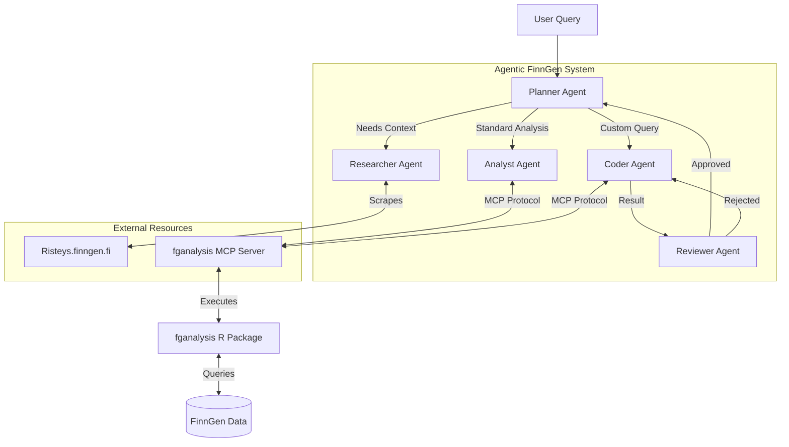

# Agentic FinnGen

## Overview
**Agentic FinnGen** is an advanced multi-agent system designed to accelerate biomedical research using FinnGen data. It leverages **Google ADK** and **Gemini** to answer complex research questions by orchestrating specialized agents.

## Problem Statement
Biomedical datasets like FinnGen offer immense potential for discovery but are notoriously difficult to navigate. Analyzing this data currently requires a rare combination of skills:
1.  **Domain Knowledge**: Understanding complex phenotypes, ontologies (OMOP), and drug classification systems (ATC).
2.  **Technical Expertise**: Proficiency in R or Python to write SQL queries, manage database connections, and execute statistical models.
3.  **Context Switching**: Researchers must constantly toggle between literature search (e.g., Risteys, PubMed) and coding environments, breaking their flow of thought.

This high barrier to entry slows down research, limits access to bioinformaticians, and leaves valuable insights undiscovered in the data.

## Key Features
-   **Multi-Agent Architecture**:
    -   **Planner**: Orchestrates the workflow and manages state.
    -   **Researcher**: Scrapes phenotype data from Risteys.
    -   **Analyst**: Performs standard statistical analysis (Drug Response, BLUP).
    -   **Coder**: Writes and executes custom R code for ad-hoc queries.
    -   **Reviewer**: Validates code logic and results.
-   **Advanced Capabilities**:
    -   **Dynamic Code Execution**: Securely runs R code via an MCP server.
    -   **Memory**: Persists session context across interactions.
-   **Observability**: Structured logging of all agent actions.

## Advanced Use Cases
Agentic FinnGen is capable of handling sophisticated, real-world research scenarios:

1.  **GLP-1 Agonist Weight Loss Analysis**
    *   *Scenario*: "Identify individuals prescribed GLP-1 receptor agonists and calculate the proportion who achieved >20% weight loss within one year of treatment initiation."
    *   *Capability*: The agent identifies GLP-1 ATC codes, retrieves weight measurements (labs), and executes custom R code to calculate percentage change per patient.

2.  **CKD Trajectory Modeling**
    *   *Scenario*: "Estimate eGFR trajectories for patients with Chronic Kidney Disease (CKD) following the initiation of ACE inhibitors or Angiotensin Receptor Blockers (ARBs)."
    *   *Capability*: The agent defines the CKD cohort and drug exposure, then utilizes the `calculate_blup_slopes` tool to model longitudinal eGFR trends.

3.  **Comorbidity and Polypharmacy Overlap**
    *   *Scenario*: "Quantify the intersection of patient cohorts diagnosed with hypertension, prescribed statins, and prescribed GLP-1 receptor agonists."
    *   *Capability*: The agent performs complex set operations on multiple cohorts (Diagnosis + Drug A + Drug B) to visualize overlaps (e.g., using UpSet plots).

4.  **Pharmacome-Wide Association Study (PheWAS)**
    *   *Scenario*: "Systematically screen all ATC drug codes to identify those associated with a significant median change in LDL cholesterol levels (comparing 6 months pre- vs. 6 months post-fulfillment)."
    *   *Capability*: The agent iterates through drug classes, running the `create_drug_response` pipeline at scale to discover novel drug-phenotype associations.

### Architecture Diagram



## Project Structure
-   `src/agents/`: Agent implementations.
-   `src/tools/`: Custom tools (Risteys Scraper, MCP Bridge).
-   `src/memory.py`: Session management.
-   `src/logger.py`: Observability.
-   `submission/`: Final notebook and write-up.

## Setup

1.  **Install Dependencies**:
    ```bash
    pip install -e .
    ```
    *Ensure `fganalysis_MCP` is installed.*

2.  **Configure Environment**:
    Set `VERTEX_API_KEY` in `.env`.

3.  **Run the Demo**:
    Open `submission/submission.ipynb` and run all cells.


## Author

**Reza Jabal, PhD**
rjabal@broadinstitute.org

## License

This project is licensed under the MIT License.
