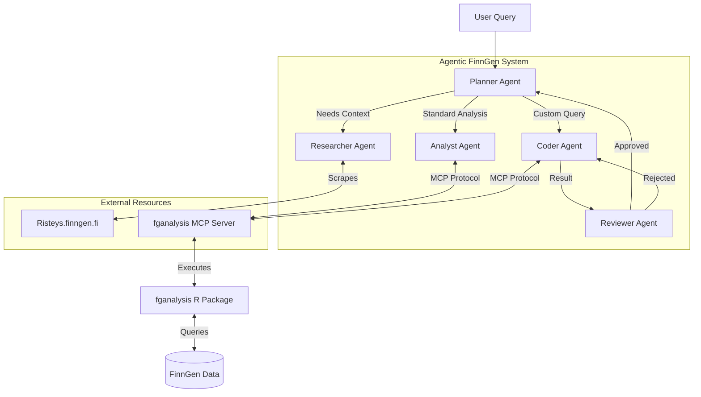

# Agentic FinnGen

**Kaggle Agents Intensive Capstone Project**
*Track: Agents for Good*

## Overview
**Agentic FinnGen** is an advanced multi-agent system designed to accelerate biomedical research using FinnGen data. It leverages **Google ADK** and **Gemini** to answer complex research questions by orchestrating specialized agents.

## Key Features
-   **Multi-Agent Architecture**:
    -   **Planner**: Orchestrates the workflow and manages state.
    -   **Researcher**: Scrapes phenotype data from Risteys.
    -   **Analyst**: Performs standard statistical analysis (Drug Response, BLUP).
    -   **Coder**: Writes and executes custom R code for ad-hoc queries.
    -   **Reviewer**: Validates code logic and results.
-   **Advanced Capabilities**:
    -   **Dynamic Code Execution**: Securely runs R code via an MCP server.
    -   **Memory**: Persists session context across interactions.
-   **Observability**: Structured logging of all agent actions.

### Architecture Diagram



## Project Structure
-   `src/agents/`: Agent implementations.
-   `src/tools/`: Custom tools (Risteys Scraper, MCP Bridge).
-   `src/memory.py`: Session management.
-   `src/logger.py`: Observability.
-   `submission/`: Final notebook and write-up.

## Setup

1.  **Install Dependencies**:
    ```bash
    pip install -e .
    ```
    *Ensure `fganalysis_MCP` is installed.*

2.  **Configure Environment**:
    Set `VERTEX_API_KEY` in `.env`.

3.  **Run the Demo**:
    Open `submission/submission.ipynb` and run all cells.
