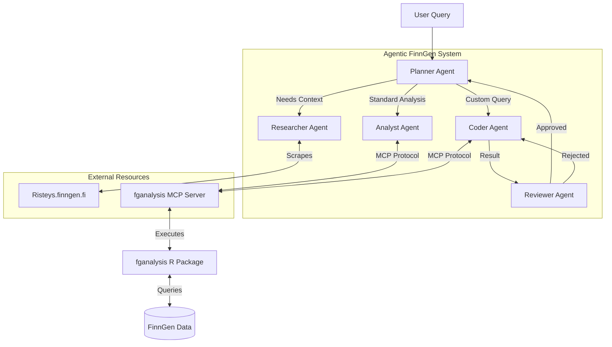

# Mithril (The Agentic FinnGen Analysis System)

## Overview
**Mithril** is an advanced multi-agent system designed to accelerate biomedical research using FinnGen data. It orchestrates specialized agents to answer complex research questions and is **LLM-provider-agnostic** — out of the box it supports **Anthropic Claude**, **Google Gemini**, **OpenAI**, **xAI Grok**, **DeepSeek**, **Mistral**, **Groq**, **Together**, **OpenRouter**, and any self-hosted OpenAI-compatible endpoint, selected by a single environment variable.

## Problem Statement
Biomedical datasets like FinnGen offer immense potential for discovery but are notoriously difficult to navigate. Analyzing this data currently requires a rare combination of skills:
1.  **Domain Knowledge**: Understanding complex phenotypes, ontologies (OMOP), and drug classification systems (ATC).
2.  **Technical Expertise**: Proficiency in R or Python to write SQL queries, manage database connections, and execute statistical models.
3.  **Context Switching**: Researchers must constantly toggle between literature search (e.g., Risteys, PubMed) and coding environments, breaking their flow of thought.

This high barrier to entry slows down research, limits access to bioinformaticians, and leaves valuable insights undiscovered in the data.

## Key Features
-   **Multi-Agent Architecture**:
    -   **Planner**: Orchestrates the workflow and manages state.
    -   **Researcher**: Scrapes phenotype data from Risteys.
    -   **Analyst**: Performs standard statistical analysis (Drug Response, BLUP).
    -   **Coder**: Writes and executes custom R code for ad-hoc queries.
    -   **Reviewer**: Validates code logic and results.
-   **Advanced Capabilities**:
    -   **Dynamic Code Execution**: Securely runs R code via an MCP server.
    -   **Memory**: Persists session context across interactions.
-   **Observability**: Structured logging of all agent actions.

## Advanced Use Cases
**Mithril** is capable of handling sophisticated, real-world research scenarios:

1.  **GLP-1 Agonist Weight Loss Analysis**
    *   *Scenario*: "Identify individuals prescribed GLP-1 receptor agonists and calculate the proportion who achieved >20% weight loss within one year of treatment initiation."
    *   *Capability*: The agent identifies GLP-1 ATC codes, retrieves weight measurements (labs), and executes custom R code to calculate percentage change per patient.

2.  **CKD Trajectory Modeling**
    *   *Scenario*: "Estimate eGFR trajectories for patients with Chronic Kidney Disease (CKD) following the initiation of ACE inhibitors or Angiotensin Receptor Blockers (ARBs)."
    *   *Capability*: The agent defines the CKD cohort and drug exposure, then utilizes the `calculate_blup_slopes` tool to model longitudinal eGFR trends.

3.  **Comorbidity and Polypharmacy Overlap**
    *   *Scenario*: "Quantify the intersection of patient cohorts diagnosed with hypertension, prescribed statins, and prescribed GLP-1 receptor agonists."
    *   *Capability*: The agent performs complex set operations on multiple cohorts (Diagnosis + Drug A + Drug B) to visualize overlaps (e.g., using UpSet plots).

4.  **Pharmacome-Wide Association Study (PheWAS)**
    *   *Scenario*: "Systematically screen all ATC drug codes to identify those associated with a significant median change in LDL cholesterol levels (comparing 6 months pre- vs. 6 months post-fulfillment)."
    *   *Capability*: The agent iterates through drug classes, running the `create_drug_response` pipeline at scale to discover novel drug-phenotype associations.

### Architecture Diagram


```mermaid
graph TD
    User[User Query] --> Planner[Planner Agent]
    
    subgraph "Agentic FinnGen System"
        Planner -->|Needs Context| Researcher[Researcher Agent]
        Planner -->|Standard Analysis| Analyst[Analyst Agent]
        Planner -->|Custom Query| Coder[Coder Agent]
        
        Coder -->|Result| Reviewer[Reviewer Agent]
        Reviewer -->|Approved| Planner
        Reviewer -->|Rejected| Coder
    end
    
    subgraph "External Resources"
        Researcher <-->|Scrapes| Risteys[Risteys.finngen.fi]
        Analyst <-->|MCP Protocol| MCPServer[fganalysis MCP Server]
        Coder <-->|MCP Protocol| MCPServer
    end
    
    MCPServer <-->|Executes| RPackage[fganalysis R Package]
    RPackage <-->|Queries| Data[(FinnGen Data)]
```

## Project Structure
-   `src/agentic_finngen/agents/`: Agent implementations (planner, researcher, analyst, coder, reviewer).
-   `src/agentic_finngen/llm/`: Provider-agnostic LLM abstraction (`base`, `loop`, `anthropic`, `gemini`, `openai_compatible`), with the provider registry in `__init__`.
-   `src/agentic_finngen/tools/`: Custom tools (Risteys scraper, fganalysis MCP bridge).
-   `src/agentic_finngen/memory.py`: Session management.
-   `src/agentic_finngen/logger.py`: Observability.
-   `src/agentic_finngen/main.py`: CLI entry point (`agentic-finngen`).
-   `submission/`: Final notebook and write-up.

## Setup

### 1. Install

The project uses [uv](https://docs.astral.sh/uv/) for venv and dependency management.

```bash
# Create a venv (skip if .venv already exists)
uv venv

# Install the project and its deps in editable mode
uv pip install -e .
```

Plain `pip install -e .` also works if you don't have `uv`.

> **Optional**: the analyst and coder agents call the [`fganalysis_MCP`](https://github.com/rezajf/fganalysis_MCP) sibling project for R-backed analyses. If it isn't installed, those tools fall back to stubs and the rest of the workflow still runs.

### 2. Configure the LLM provider

Mithril picks an LLM provider from environment variables at process start. Copy
`.env.example` to `.env` at the repo root and fill in one credential:

```dotenv
LLM_PROVIDER=gemini
GEMINI_API_KEY=AIza...
# LLM_MODEL=gemini-2.5-pro   # omit to take the provider default
```

Switching labs is a config change, never a code change:

| `LLM_PROVIDER` | API key variable | Default model |
| --- | --- | --- |
| `anthropic` (aka `claude`) | `ANTHROPIC_API_KEY` | `claude-opus-5` |
| `gemini` (aka `google`) | `GEMINI_API_KEY` | `gemini-2.5-pro` |
| `openai` (aka `gpt`) | `OPENAI_API_KEY` | set `LLM_MODEL` |
| `xai` (aka `grok`) | `XAI_API_KEY` | set `LLM_MODEL` |
| `deepseek` | `DEEPSEEK_API_KEY` | set `LLM_MODEL` |
| `mistral` | `MISTRAL_API_KEY` | set `LLM_MODEL` |
| `groq` | `GROQ_API_KEY` | set `LLM_MODEL` |
| `together` | `TOGETHER_API_KEY` | set `LLM_MODEL` |
| `openrouter` | `OPENROUTER_API_KEY` | set `LLM_MODEL` |
| `openai-compatible` | `LLM_API_KEY` | set `LLM_MODEL` |

Anthropic and Gemini use their native SDKs. Everything below them speaks the
OpenAI `/chat/completions` dialect and differs only by base URL, so the same
adapter also fronts self-hosted vLLM or Ollama servers:

```dotenv
LLM_PROVIDER=openai-compatible
LLM_BASE_URL=http://localhost:11434/v1
LLM_API_KEY=ollama
LLM_MODEL=<model served there>
```

Those providers need the optional extra: `pip install -e '.[openai]'`.

A default model is only pre-set where a current function-calling id is known;
elsewhere `LLM_MODEL` is required rather than guessed, because a stale default
surfaces as a confusing 404 on the first call. Discover what your own key can
reach, and override either setting per run:

```bash
agentic-finngen --list-providers
agentic-finngen --list-models
agentic-finngen --provider gemini --model gemini-2.5-flash "your question"
```

`LLM_MAX_TOKENS` caps output on whichever provider is active.

**Vertex AI (Gemini) instead of API key:** set `GOOGLE_GENAI_USE_VERTEXAI=true` plus `GOOGLE_CLOUD_PROJECT` and `GOOGLE_CLOUD_LOCATION`, and authenticate with `gcloud auth application-default login`.

### 3. Configure the FinnGen database (optional)

To point the fganalysis tools at a specific DB config, set:

```dotenv
FGANALYSIS_CONFIG_PATH=/abs/path/to/db_config.json
```

The bridge auto-injects this into every fganalysis tool call. Without it, the MCP server uses its own default.

### 4. Logging verbosity (optional)

All output flows through a central logger ([`src/agentic_finngen/logger.py`](src/agentic_finngen/logger.py)). By default it runs at `INFO`, which shows user-facing UI — workflow progress and final results. Verbose internals (raw model responses, full research summaries, intermediate plans) are logged at `DEBUG` and hidden unless you opt in:

```bash
# Enable debug output for a single run
AGENTIC_FINNGEN_LOG_LEVEL=DEBUG agentic-finngen "your question here"
```

```dotenv
# Or set it persistently in .env
AGENTIC_FINNGEN_LOG_LEVEL=DEBUG
```

Any standard level name works (`DEBUG`, `INFO`, `WARNING`, `ERROR`); unknown values fall back to `INFO`. Output goes to stdout and to `agent_trace.log`.

## Running the workflow

### CLI

```bash
# Positional query
.venv/bin/agentic-finngen "How many patients on statins have BMI > 40?"

# Or activate the venv once per shell
source .venv/bin/activate
agentic-finngen "Calculate eGFR trajectories for CKD patients on ACE inhibitors"

# Or use uv run (auto-syncs deps, no activation needed — recommended in dev)
uv run agentic-finngen "your question here"

# Read query from stdin (handy for long prompts)
cat long_query.txt | agentic-finngen
agentic-finngen -                                     # same: '-' means stdin

# Resume a session
agentic-finngen --session-id abc123 "follow-up question"
```

The CLI prints intermediate stages (research summary, plan, results) and exits.

### Notebook

```bash
.venv/bin/jupyter lab submission/submission.ipynb
```

Cells run the same agents end-to-end and demonstrate three research scenarios (GLP-1, CKD, comorbidity overlap), session memory inspection, log parsing, and an LLM-based evaluation step — all provider-agnostic.

### From Python

```python
from dotenv import load_dotenv
from agentic_finngen.agents.planner import PlannerAgent

load_dotenv()
result = PlannerAgent().execute_workflow("your question here")
print(result)
```


## Author

**Reza Jabal, PhD**
rjabal@broadinstitute.org

## Contributor
**Mitja Kurki, PhD**
mkurki@broadinstitute.org

## License

This project is licensed under the MIT License.
