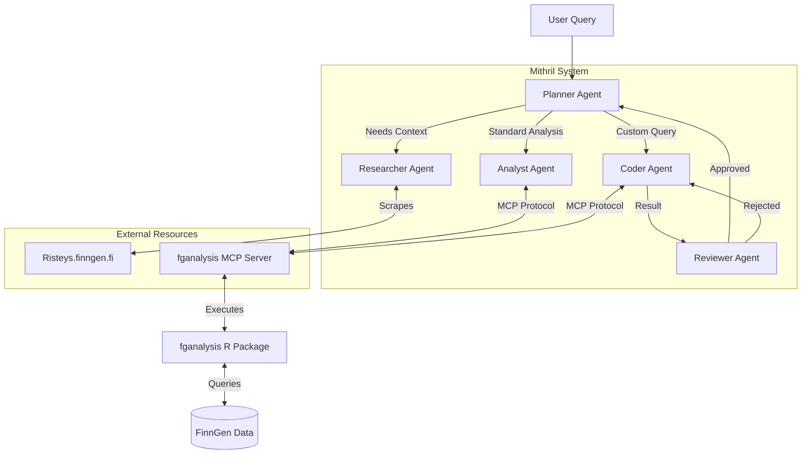

# Mithril (The Agentic FinnGen Analysis System)

**Hackathon Writeup** · **Agents Intensive - Capstone Project**
**Track**: Agents for Good

## Problem Statement
Biomedical datasets like FinnGen offer immense potential for discovery but are notoriously difficult to navigate. Analyzing this data currently requires a rare combination of skills:
1.  **Domain Knowledge**: Understanding complex phenotypes, ontologies (OMOP), and drug classification systems (ATC).
2.  **Technical Expertise**: Proficiency in R or Python to write SQL queries, manage database connections, and execute statistical models.
3.  **Context Switching**: Researchers must constantly toggle between literature search (e.g., Risteys, PubMed) and coding environments, breaking their flow of thought.

This high barrier to entry slows down research, limits access to bioinformaticians, and leaves valuable insights undiscovered in the data.

## Why agents?
Agents are the ideal solution for this problem because biomedical research is inherently **iterative** and **multi-modal**. A simple chatbot cannot handle the complexity of:
*   **Planning**: Breaking down a vague clinical question ("Effect of statins on LDL") into a sequence of precise data operations.
*   **Tool Use**: Interacting with specialized bioinformatics tools (R packages, databases) that require strict syntax.
*   **Error Recovery**: Real-world code often fails. Agents can read error messages, debug their own code, and retry—something a standard script or LLM cannot do.

**Mithril** acts as a virtual research assistant that bridges the gap between medical expertise and bioinformatics. By automating the translation of clinical questions into rigorous statistical analyses, it democratizes access to the data and accelerates the pace of discovery.

## What we created
We created **Mithril**, a hierarchical multi-agent system orchestrated by a **Planner Agent**. This modular design allows for specialized reasoning and robust error handling.

### Architecture
1.  **Planner Agent (Orchestrator)**: The central brain. It breaks down user queries into a logical plan, delegates tasks to sub-agents, and manages the session memory.
2.  **Researcher Agent**: The domain expert. It uses a custom tool to scrape `risteys.finngen.fi`, providing the system with definitions, statistics, and ontology codes for phenotypes.
3.  **Analyst Agent**: The statistician. It interfaces with the `fganalysis` MCP server to run pre-defined, complex analysis pipelines (e.g., `create_drug_response`).
4.  **Coder Agent**: The programmer. When a query falls outside standard pipelines, this agent writes custom R code to manipulate the data directly.
5.  **Reviewer Agent**: The auditor. It reviews the output of the Coder Agent, checking for logical errors or empty results, and triggers a retry loop if necessary.

### System Diagram

## Demo
The capabilities of Mithril are demonstrated in the `submission.ipynb` notebook. The demo showcases:

1.  **GLP-1 Agonist Weight Loss Analysis**: The agent identifies GLP-1 ATC codes, retrieves weight measurements, and executes custom R code to calculate percentage weight loss per patient.
2.  **CKD Trajectory Modeling**: The agent utilizes the `calculate_blup_slopes` tool to model longitudinal eGFR trends in patients with Chronic Kidney Disease.
3.  **Comorbidity Overlap**: The agent performs complex set operations to visualize the intersection of hypertension, statin use, and GLP-1 prescription.

These scenarios prove that Mithril can handle both standard statistical pipelines and ad-hoc, complex queries requiring dynamic code generation.

## The Build
Mithril was built using the **Google Agent Development Kit (ADK)** and **Gemini 1.5 Pro**.

### Core Technologies
*   **Google ADK**: For defining agents, tools, and the orchestration loop.
*   **Gemini 1.5 Pro**: The reasoning engine powering all agents.
*   **Model Context Protocol (MCP)**: A custom MCP server was built to bridge the Python-based agents with the R-based bioinformatics environment.

### Essential Tools
*   **fganalysis MCP Server**: Exposes the `fganalysis` R package functions (`run_drug_response_analysis`, `calculate_blup_slopes`) and a secure `execute_r_code` sandbox.
*   **Risteys Scraper**: A custom tool that parses `risteys.finngen.fi` to extract phenotype metadata.
*   **FileBasedMemory**: A custom memory module that persists session context across turns.
*   **Structured Logging**: A logging system that captures every agent thought and action for observability.

## If I had more time, this is what I'd do
If I had more time, I would expand Mithril to cover the entire drug discovery value chain:

1.  **Integrated GWAS & Burden Analysis**: I would add specialized agents and tools to perform Genome-Wide Association Studies (GWAS) and gene burden tests directly within the workflow. This would enable users to swiftly transition from a phenotype query to identifying significant genetic variants.
2.  **TxGemma Integration**: I would integrate with **TxGemma** (Therapeutics Gemma), a model fine-tuned for drug discovery tasks. This would enable the agent to not only identify targets but also suggest potential therapeutic compounds and predict their properties.
3.  **End-to-End Drug Discovery Agent**: By combining phenotype analysis (Mithril), genetic association (GWAS), and target validation (TxGemma), I would create a truly end-to-end agent that can hypothesize a target and validate it in silico using real-world evidence from FinnGen.

## Author
**Reza Jabal, PhD**
rjabal@broadinstitute.org

## License
This project is licensed under the MIT License.
