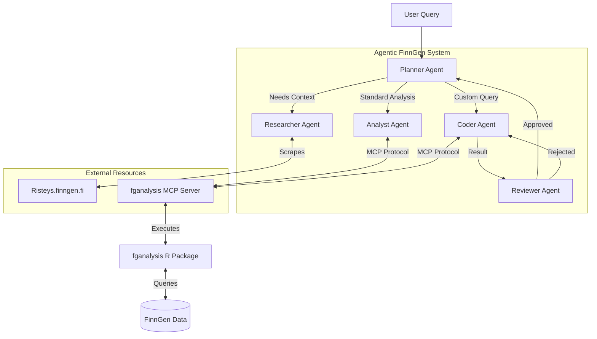

# Agentic FinnGen

**Hackathon Writeup** · **Agents Intensive - Capstone Project**
**Track**: Agents for Good

## Project Overview
**Agentic FinnGen** is a sophisticated multi-agent system designed to democratize access to complex biomedical data analysis. Built using the **Google Agent Development Kit (ADK)** and **Gemini**, it acts as a virtual research assistant that empowers clinicians and researchers to explore the massive FinnGen dataset using natural language. By automating the translation of clinical questions into rigorous statistical analyses, it bridges the gap between medical expertise and bioinformatics.

## Problem Statement
Biomedical datasets like FinnGen offer immense potential for discovery but are notoriously difficult to navigate. Analyzing this data currently requires a rare combination of skills:
1.  **Domain Knowledge**: Understanding complex phenotypes, ontologies (OMOP), and drug classification systems (ATC).
2.  **Technical Expertise**: Proficiency in R or Python to write SQL queries, manage database connections, and execute statistical models.
3.  **Context Switching**: Researchers must constantly toggle between literature search (e.g., Risteys, PubMed) and coding environments, breaking their flow of thought.

This high barrier to entry slows down research, limits access to bioinformaticians, and leaves valuable insights undiscovered in the data.

## Solution Statement
**Agentic FinnGen** solves this by providing an intelligent interface that understands biomedical context and executes code autonomously.
*   **Automated Research**: The agent actively researches phenotypes on `risteys.finngen.fi` to understand the medical context of a query (e.g., mapping "Colitis" to "K51").
*   **Code Generation & Execution**: It dynamically writes and executes R code to answer ad-hoc questions (e.g., "How many patients with BMI > 40?"), removing the need for manual coding.
*   **Rigorous Analysis**: It leverages the `fganalysis` R package to perform standardized, high-quality statistical analyses like Drug Response and BLUP (Best Linear Unbiased Predictor) modeling.
*   **Self-Correction**: A multi-agent feedback loop ensures that generated code is reviewed and corrected before results are presented.

## Architecture
The core of Agentic FinnGen is a hierarchical multi-agent system orchestrated by a **Planner Agent**. This modular design allows for specialized reasoning and robust error handling.

### The Agents
1.  **Planner Agent (Orchestrator)**: The central brain. It breaks down user queries into a logical plan, delegates tasks to sub-agents, and manages the session memory.
2.  **Researcher Agent**: The domain expert. It uses a custom tool to scrape `risteys.finngen.fi`, providing the system with definitions, statistics, and ontology codes for phenotypes.
3.  **Analyst Agent**: The statistician. It interfaces with the `fganalysis` MCP server to run pre-defined, complex analysis pipelines (e.g., `create_drug_response`).
4.  **Coder Agent**: The programmer. When a query falls outside standard pipelines, this agent writes custom R code to manipulate the data directly.
5.  **Reviewer Agent**: The auditor. It reviews the output of the Coder Agent, checking for logical errors or empty results, and triggers a retry loop if necessary.

### System Diagram

## Essential Tools and Utilities
The agents are equipped with powerful tools that extend their capabilities beyond text generation.

### fganalysis MCP Server
We developed a custom **Model Context Protocol (MCP)** server to expose the functionality of the `fganalysis` R package. This server runs as a separate process and provides tools like:
*   `run_drug_response_analysis`: Automates the creation of drug response cohorts and summary plots.
*   `calculate_blup_slopes`: Runs Linear Mixed Models to estimate individual disease trajectories.
*   `execute_r_code`: A secure sandbox for executing arbitrary R code generated by the Coder Agent.

### Risteys Scraper
A custom ADK tool that allows the Researcher Agent to navigate the Risteys website. It parses HTML content to extract structured data about phenotypes, including prevalence, descriptions, and related ontology codes.

### Memory & Observability
*   **FileBasedMemory**: Persists the conversation history and context (e.g., identified OMOP codes) across turns, allowing for multi-step reasoning.
*   **Structured Logging**: Every agent action, thought process, and tool call is logged to `agent_trace.log` for debugging and evaluation.

## Conclusion
Agentic FinnGen demonstrates the power of combining Large Language Models with specialized domain tools. By wrapping a rigorous bioinformatics package (`fganalysis`) in an agentic interface, we have created a system that is both accessible to non-coders and powerful enough for real research. It transforms the role of the researcher from a data wrangler to a scientific director.

## Value Statement
**Accelerating Discovery**: What previously took hours of writing R scripts and consulting documentation now takes minutes of natural language interaction.
**Democratizing Access**: Clinicians without coding skills can now ask complex questions about patient cohorts and treatment outcomes directly.
**Ensuring Quality**: By using the validated `fganalysis` package under the hood, the agent ensures that analyses follow best practices, reducing the risk of human error in ad-hoc scripting.

## Author
**Reza Jabal, PhD**
rjabal@broadinstitute.org

## License
This project is licensed under the MIT License.
